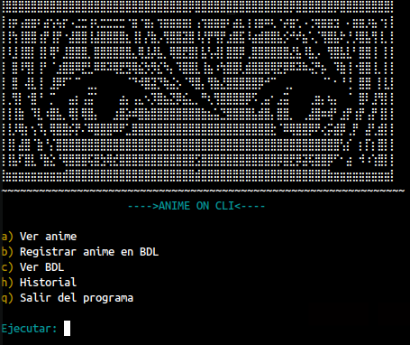

# Anime On CLI
--Script en bash para ver anime en español desde la terminal--
######

######
### Programas necesarios
- wget
- curl
- html2text
- mpv
### Ejecución
Para ejecutar el programa solo necesitas añadir permisos al script con ***chmod +x aocli.sh*** e inciarlo con ***./aocli.sh***, los archivos BDL e historial son para que no dé errores en la consola pero puedes no descargarlos puesto que se crean automáticamente por el mismo programa.
### Funciones
Principalmente está ver anime, donde debes introducir el nombre del anime, o una parte de este, y se te indexará el contenido, después podrás elegir un capítulo específico a ver y concluído éste podrás pasar al siguiente capítulo. Cuenta con un historial de capítulos vistos, así como una escueta Base de Datos Local (un simple archivo txt) donde podrás guardar el nombre del anime que desees en las distintas categorías que hay :D
######
